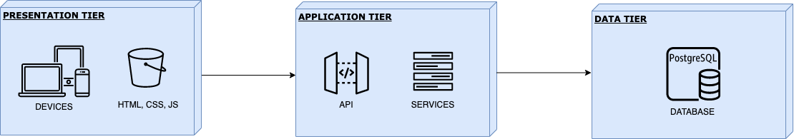
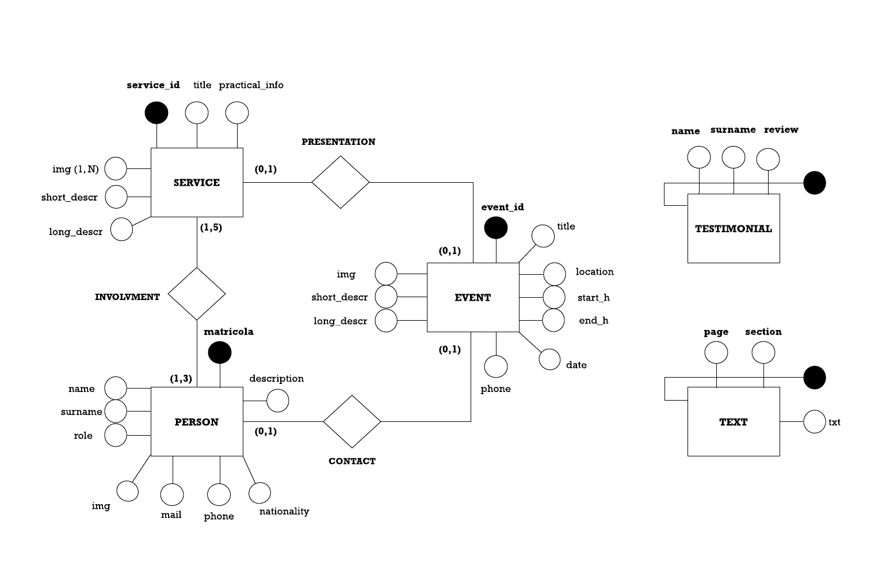
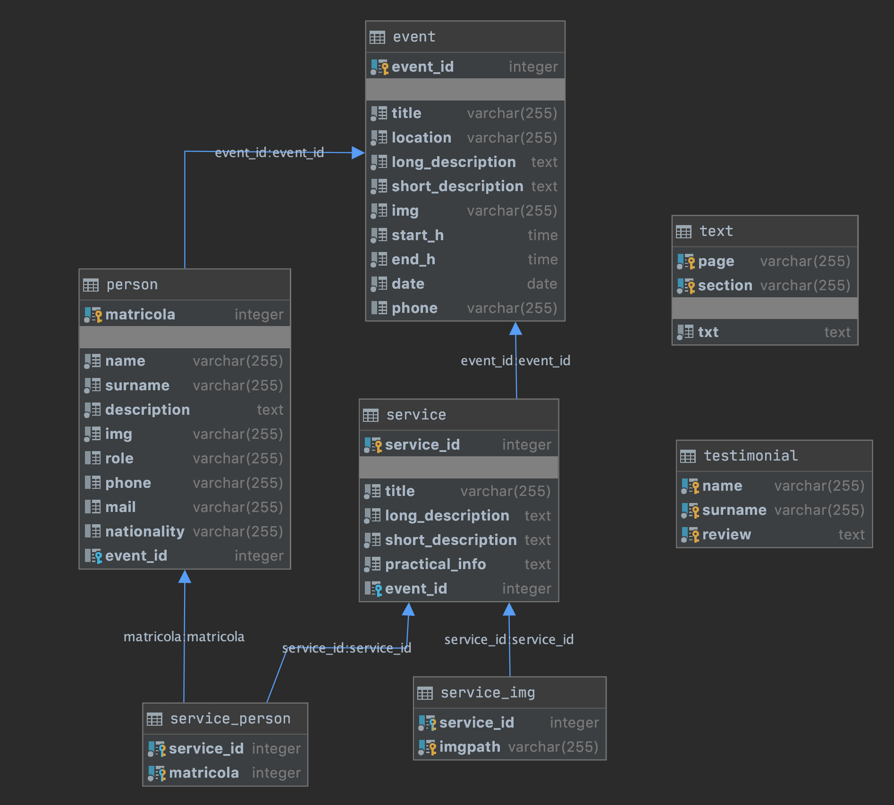

# Documentation of the Backend part

> Deliverable D1

## General group information

| Member n. | Role          | First name | Last Name | Matricola | Email address   |
| --------- | ------------- | ---------- | --------- | --------- | --------------- |
| 1 | administrator | Dario | Miceli Pranio | 928262 | dario.miceli@mail.polimi.it |
| 2 | member | Adriano | Mundo | 944684 | adriano.mundo@mail.polimi.it |
| 3 | member | Salvatore | Fadda | 944786 | salvatore.fadda@mail.polimi.it |

## Links to other deliverables

 - Deliverable D0: the web application is accessible at [this address](https://wildocean.herokuapp.com).
 - Deliverable D2: the YAML or JSON file containing the specification of the app
  API can be found at [this address](https://wildocean.herokuapp.com/backend/spec.yaml).
 - Deliverable D3: the SwaggerUI page of the same API is available at
  [this address](https://wildocean.herokuapp.com/backend/swaggerui).
 - Deliverable D4: the source code of D0 is available as a zip file at
  [this address](https://wildocean.herokuapp.com/backend/app.zip).
 - Deliverable D5: the address of the online source control repository is
  available [this address](https://github.com/dariomiceli3/WildOcean). We hereby declare that this
  is a private repository and, upon request, we will give access to the
  instructors.
  
## Specification

### Web Architecture

The application was designed with a three tier architecturec, composed of a Presentation Tier, an Application
Tier and a Data Tier which represent the three main actors of our architecture; they interact each other  as shown
in the picture below.  
  
The Presentation Tier shows all the information to the user as HTML pages (static or dynamic). All the pages
are rendered client side since they use an API schema.  
The Application Tier interacts between the two responding to request to API endpoint received
by the client and retrieving data from the database.   
The Data Tier represents the DBMS and the storage part, in our case implemented with PostgreSQL.

### API

#### REST compliance

We developed our RESTful API in compliance with the REST Architectural Constraints:
 - Client-server architecture: everything is based on the separation of concerns; therefore, the client
 can interact with the server through the public endpoints and they can be deployed on different machines
 because they work independently. 
 - Statelessness: no client context is stored on the server between requests and each request
 from any client contains all the information necessary to serve the request. No state information are saved.
 - Cacheability: it has not been implemented a caching mechanism, everything that is cached 
 depend upon thr browser. 
 - Code on demand: the server serve the request of the client responding with static data available 
 in the DB as JSON files.
 - Uniform Interface: it is fundamental as decouples the architecture; individual resources are 
 identified in requests using URI. The resources are separated from the representation returned
 to the client. The server send its data in form of JSON files without exposing the internal representation. 
 Each message includes enough information to describe how to process the message.

#### OpenAPI Resource models

 - Events: it is the representation of an event organized by the association. It is represented by
 the ID, title, location, date, time, short and long description, the contact phone and the url of the 
 associated image
 - Person: it is the representation of a person which is part of the association. It is represented by
 the matricola code, name, surname, a description, role, phone, mail, nationality,url of the associated 
 image and the ID of the event which is organising. 
 - Services: it is the representation of a service provided by the association. It is represented by 
 the ID, title, pratical information, a short and long description, the event ID of the associated event
 and a list of the images' url 
 - Testimonials: it is the representation of a testimonial of the association. It is represented by 
 the name, surname of the testimonial and his/her review. 
 - Text: it is the representation of a text of the website, identified by page, section and the txt

### Data model

In this section there are the representation of the ER diagram and the Logical Design used in our application. 

There's a 1 to 1 correspondence between the OpenaAPI Data Models and the relation tables of our
database, except for the list of images' url of services which are stored in a different table. 

## Implementation

### Tools used

#### Environment

- Node.js: open source and cross-platform JavaScript runtime env built on Chrome V8 JS Engine. It executes
code outside of a web browser and it was used for the back-end of the project. 

- Heroku: cloud environment for hosting our web application and database remotely. 

#### Tools

- Webstorm and Database Tools: powerful IDE by JetBrains for development of web application. It supports
the development of front-end and back-end. It was mainly used for the back-end development because 
of the support for Node.js and for the use of Database Tools and SQL Plugin which help to directly connect 
to the PostgreSQL Database on Heroku. 

- Brackets: IDE for web-development, it was used for the front-end development for taking advantage of the
Live Preview feature which enable to concurrently modify code and rendered pages.  

- Swagger Editor: open source editor for OpenAPI-based APIs. It is very friendly and easy to create
OpenAPI specification with support for Swagger 2.0 and OpenAPI 3.0. It was used to design our APIs 
with version 2.0. 

#### Languages

- JavaScript for Back-End
- HTML, CSS, JavaScript for Front-End

#### Frameworks and Libraries

- Knex.js: query builder for the most famous DBMS designed to be flexible, portable and fun to use.  
- Serve-Static: Node.js library for serving static content over HTTP
- Jquery: JavaScript library for front-end scripting
- Bootstap: front-end framework for front-end respnsive layout development 

### Discussion

We started realizing our application from designing the OpenAPI specification with the Swagger Editor. Then, we used
the swagger generated node-js server for controllers and services.  
The controllers are the same generated from the swagger while the services have been modified in order to 
communicate with the DBMS through Knex.js. Here, we implemented all the queries which retrieve data directly from the database.
All the designed endpoints were tested both manually and with swaggerUI. We used async-awaits for services.  
  
As mentioned before, the application is divided in three layers: Presentation, Application and Data. The presentation
layer is implemented by the front-end that has static HTML pages which use API to retrieve data. The Application 
layer is implemented by the back-end and finally the data layer is implemented by the database, which is seprated from the server. 
For the data layer we used a RDBMS, PostgreSQL. 

## Other information

### Task assignment

We divided the workload among all the team members.

Dario Miceli
- Design: contributed to IDM models, ER and Logic schema, scenarios, wireframes.  
- Front-End: implemented HTML pages, jQuery and AJAX dynamic content.
- Back-End: openAPI specification. 

Adriano Mundo
- Design: contributed to IDM models, ER, wireframes and mockups. 
- Front-End: implemented jQuery and AJAX dynamic content, styling of the website.
- Back-End: openAPI specification, node.js services and query implementation, DB manteinance.  
 
Salvatore Fadda
- Design: contributed to IDM models, wireframes, mockups, scenarios. 
- Front-End: implemented HTML pages, styling of the website, shared content between pages. 
- Back-End: openAPI specification. 

### Analysis of existing API

Before this project, just one the team member developed the back-end part of a web application during another university
course, but he was not aware of the Swagger Editor tool which is very interesting. 
We started designing our API taking inspiration from the lecture in a first attempt, then we studied 
[this guide](https://idratherbewriting.com/learnapidoc/pubapis_openapi_tutorial_overview.html) and finally
we analysed the existing API of [eventbrite](https://www.eventbrite.com/platform/api#/reference/online-event-page) because
we noticed that their API specification are RESTful compliant and are very structured in a clear way. 

### Learning outcome

Dario Miceli learnt how APIs work, how to evaluate website usability and how to design them, how to model
the structure of a website through formal schemas. He also learnt from scratch HTML, CSS, Javascript, jquery and
asyncrhonous programming. 

Adriano Mundo learnt how APIs work, how to design responsive and usable website, how to mdoel them. He deepened 
his previous background on HTML, CSS and learnt from scratch JS, jquery and asynchornous programming
and how to implement a back-end server with node.js and a DB, both in localhost and on cloud platform with postegreSQL. 
He discovered Knex.js for writing queries to access the database. 

Salvatore Fadda learnt how APIs work, how to design responsive website and how to write technical documentation
for a website. He learnt how back-end works in order to serve front-end static content and HTML, CSS from scratch.
He was previous acquainted with Javascript that he studied more in depth with jQuery while also learning how to deal with
asynchronous programming. 